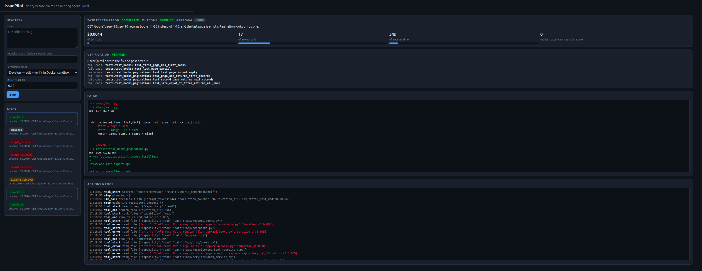
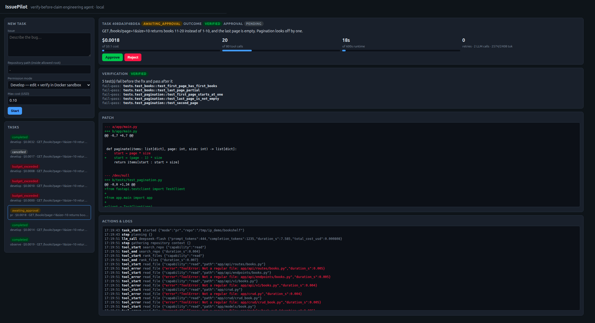
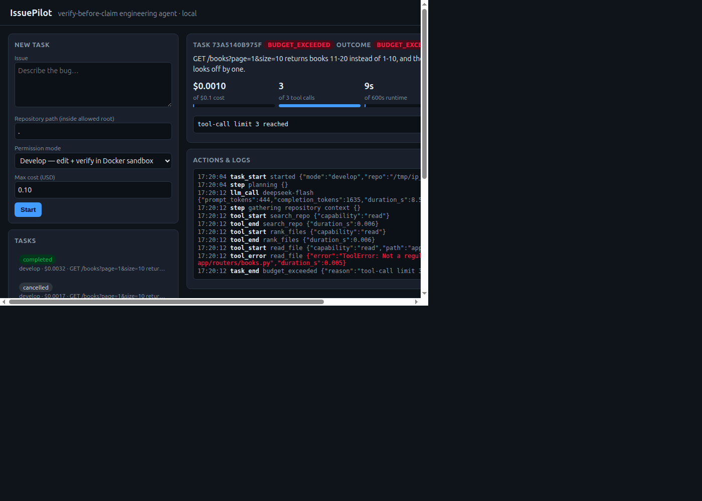
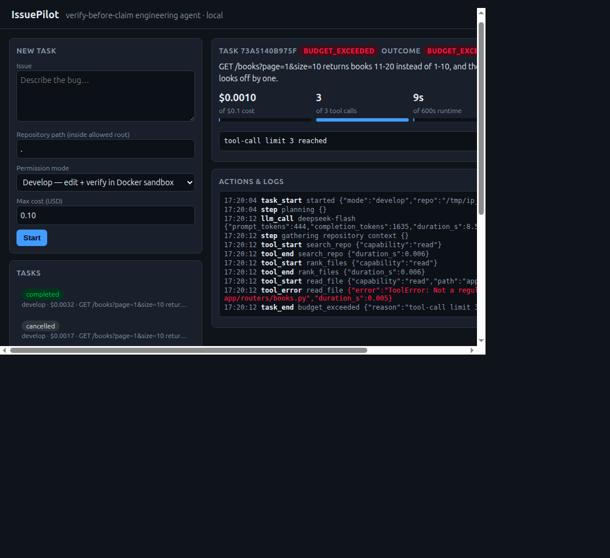
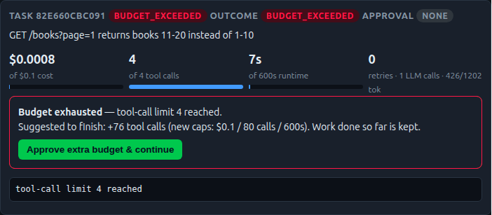

# IssuePilot

**A local agent that turns a GitHub issue into a *verified* patch and, after human approval, a
draft pull request. Merging requires a separate explicit dashboard confirmation.**

## What it does, why, and how

- **What.** Give it an issue and a Python/FastAPI repo. It investigates the code, proposes a fix,
  applies it to a throw-away copy, runs the tests in a locked-down Docker container, and reports
  what happened, what it cost, and whether the fix is *proven*.
- **Why.** Most "AI fixes bugs" demos stop at "the model produced a diff". That diff may be wrong,
  may break other tests, and the model will happily say it worked. IssuePilot treats the model as
  an untrusted proposer and makes deterministic code decide what is allowed and what is true.
- **How.** A LangGraph workflow (`plan, gather, analyze, propose, verify, finalize`) with SQLite
  checkpoints, three permission modes, no shell tool, hard cost/time/tool/retry limits, and a
  fail-to-pass rule: a fix is `verified` only if at least one test fails on the original code and
  passes on the patched code. In PR mode a human approves before anything leaves the machine.

It is not a chatbot and not a patch generator: it is a workflow with state, tools, permissions,
verification and accounting around an LLM.



| Dashboard | |
|---|---|
| Verified fix awaiting approval (PR mode): cost, tools, time, fail-to-pass evidence, patch, log |  |
| Hard limit: stopped at 3 tool calls |  |
| Cancelled mid-run |  |

```
issue -> plan -> gather -> analyse (observe)
                        \-> propose -> verify (Docker, no network) -> retry<=N -> finalize
                                                     |
                      verified? -- PR mode --> awaiting_approval -> approve -> branch/commit/push
                                                                      -> DRAFT PR -> read CI -> <=K follow-ups
                                                                      -> confirm merge (green checks only)
```

## Results at a glance
- **Live benchmark: 24/25 correct (96%)** on 25 varied bugs, scored by hidden oracle tests the agent
  never sees; 0 false "verified" claims; about 0.17 cents per task. The one failure ended as
  `tests_failed` and was *not* reported as success. Small synthetic projects, one run per case: see
  [docs/EVALUATION.md](docs/EVALUATION.md) for the limits of this number.
- **Harness evals: 16/16** (2 success, 5 failure, 9 security cases) with scripted hostile models.
- 100+ unit/integration tests, `ruff` and strict `mypy` clean.
- The draft-PR and explicit-merge flows are tested against a local bare remote and mocked GitHub API;
  neither has yet been exercised against a live GitHub repository.

Docs: [Architecture](docs/ARCHITECTURE.md) | [Evaluation](docs/EVALUATION.md)

## Quickstart: run and test it easily

```bash
make install     # uv sync
cp .env.example .env   # then put your DEEPSEEK_API_KEY in .env (never commit it)
make test        # 120+ offline tests, no API key or Docker needed
make eval        # 16 offline eval cases (success / failure / security)
make demo        # real fix of the bundled buggy app (needs key + Docker)
make serve       # dashboard at http://127.0.0.1:8765 (set ISSUEPILOT_REPOS_ROOT)  (Ctrl+C to stop)
```

Monorepo / subfolder projects: `issuepilot fix "..." --repo <clone> --subdir examples/bookshelf --mode pr`
analyses and tests only that folder; the PR commit touches `examples/bookshelf/...`.

Draft PR flow (needs a fine-grained token exported in *your* shell):
`export GITHUB_TOKEN=...` → `issuepilot fix ... --mode pr` → `issuepilot approve <id>` →
`issuepilot publish <id> --slug owner/repo`. This never merges automatically and never pushes
the fix branch to the default branch. In the dashboard, **Merge PR** appears only for an approved,
verified published task. Clicking it asks for a second confirmation; the server checks that the
PR is still open, its branch/base match the task, and all GitHub check runs pass before merging.
Missing, pending or failing checks block the merge. The actual merge writes to the PR's base branch.

## Setup
```bash
uv sync
cp .env.example .env     # then edit .env and set DEEPSEEK_API_KEY (.env is git-ignored; never commit it)
docker --version         # needed for sandboxed test runs (python:3.12-slim is pulled on first use)
```

## Permission modes
| Mode | Can do | Cannot do |
|---|---|---|
| `observe` | read repo, static + LLM analysis, GitHub reads | edit, run tests, write anywhere |
| `develop` (default) | + edit a disposable copy, run tests in the sandbox, produce a patch | touch your repo, GitHub writes |
| `pr` | + after **explicit approval**: push `issuepilot/<task>`, open a **draft** PR, read CI, bounded follow-ups; separately confirm a merge in the dashboard after checks pass | automatic merge, push the fix branch to the default branch, edit workflows |

Enforced in code (`modes.py`, every tool call goes through `TaskContext.tool`), not by prompt.

## Usage
```bash
uv run issuepilot fix "POST /items 500s on empty body" --repo ~/code/app            # develop
uv run issuepilot fix "..." --repo ~/code/app --mode observe                          # analysis only
uv run issuepilot fix "..." --repo ~/code/app --mode pr                               # -> awaiting_approval
uv run issuepilot tasks; uv run issuepilot task <id>                                  # history + event log
uv run issuepilot approve <id>; uv run issuepilot publish <id>                        # needs GITHUB_TOKEN
# then select the task in the dashboard and use "Merge PR" only after reviewing it
uv run issuepilot ci <id>                                                             # read CI, <=2 fix rounds
uv run issuepilot cancel <id>; uv run issuepilot resume <id>
uv run issuepilot discover --repo ~/code/app          # proactive bug report (read-only)
uv run issuepilot eval [--live]                       # evaluation suite
# UI + API (localhost): task progress, actions, logs, test results, approval, cost
ISSUEPILOT_REPOS_ROOT=~/code uv run uvicorn issuepilot.api.app:app_factory --factory --host 127.0.0.1   # http://127.0.0.1:8000, Ctrl+C to stop
```
Limits per task (flags): `--max-cost` (default $0.10, enforced by capping `max_tokens` before each
call), `--max-seconds` 600, `--max-tool-calls` 80, `--max-attempts` 3; CI follow-ups capped at 2.

### Try it in two minutes
`examples/bookshelf` is a tiny FastAPI app with a planted pagination bug (two of its tests fail).
```bash
cp -r examples/bookshelf /tmp/bookshelf
uv run issuepilot fix "GET /books?page=1 returns books 11-20 instead of 1-10; the last page is empty" --repo /tmp/bookshelf
```
Your copy in `/tmp/bookshelf` is never modified; the verified patch is printed (use `-o fix.patch` to save it).

### When a budget is exhausted

Limits are hard stops. A task that hits one ends as `budget_exceeded` (work and spend so far are
kept). The dashboard then shows what stopped it and an *estimated* extension; a human clicks
**Approve extra budget & continue** (or runs `issuepilot extend <id> [--usd N --tool-calls N --seconds N]`)
and the task resumes from its checkpoint and is verified again. The estimate is a heuristic
(raise the exhausted limit to at least the default, or double it). Extensions can never exceed
absolute ceilings ($5, 3600 s, 500 tool calls), and every extension is written to the audit log.



## Outcomes (what "success" means)
- `verified`: suite passes after the fix **and** at least one test fails on the original code and passes with the fix.
- `unproven`: suite passes but nothing demonstrates the fix (the agent first asks the model for a regression test).
- `tests_failed`, `failed`, `unverified` (tests skipped), `analysis_only` (observe).
- Task statuses: `running`, `completed`, `awaiting_approval`, `pr_opened`, `merged`, `rejected`, `failed`, `cancelled`, `budget_exceeded`, `interrupted`.
- Only `verified` results can be approved for a PR.

## GitHub token (PR mode)
Use a fine-grained token limited to **one repository**: Contents RW, Pull requests RW, Checks/Actions R,
Issues R, Metadata R. `export GITHUB_TOKEN=...`. The token reaches git via `GIT_ASKPASS` only
(never in URLs/argv) and is redacted from logs, events and errors. Not tested against live GitHub
in this repo's CI: the flow is tested with a local bare git remote plus a mocked GitHub API.

## Demo: fixing a bug in a real repo
Tested on [sbartaula/Flowtrack](https://github.com/sbartaula/Flowtrack) (~5k lines, 49 existing tests).
Flowtrack had no open issues, so a one-line bug was planted in a throwaway copy
(`_top_apps` sorted ascending) that the existing tests did not catch. The issue, as a user would write it:

> The 'Top apps' section of the analysis report lists my least-used apps first. Slack (5 min) appears above VS Code (3 hours). It should list apps by time spent, highest first. Please also add a regression test.

```bash
uv run issuepilot fix "<issue above>" --repo /tmp/flowtrack-copy --run-tests \
  --python /tmp/venv/bin/python -o fix.patch
```
Result: `status: ready (attempts: 1)`, 15.6k tokens, about $0.005. The agent changed the sort to
descending, added 4 regression tests, and the full suite passed in the sandbox. Independently
checked: the patch applies cleanly with `git apply`, and the new tests fail on the buggy code.
See [examples/flowtrack-top-apps.patch](examples/flowtrack-top-apps.patch).

One planted bug on one repo is a smoke test, not a benchmark.

### Planted-bug results (small FastAPI shop app, 4 existing tests that miss each bug)
| Bug | Issue symptom | Runs | Result | Avg cost |
|---|---|---|---|---|
| `limit - 1` off-by-one in `GET /items` | "returns one fewer than requested" | 3 | 3/3 ready, 1 attempt | $0.0014 |
| Discount rate applied backwards (in `services/pricing.py`, not the router) | "charged 12.00 instead of 108.00" | 3 | 3/3 ready, 1 attempt | $0.0016 |
| Negative price accepted (`Field(ge=0)` removed) | "negative price accepted with 201" | 3 | 3/3 ready, 1 attempt | $0.0015 |

Before the prompt/error-feedback fix, one of the first three runs failed (the model's edit to an
existing test file didn't match exactly). Now mismatches show the model the real file contents
and new tests go into new files. (These pre-date fail-to-pass verification; today's `verified` status additionally requires a test that fails before and passes after.) Always review the patch. 9 runs on small repos is a smoke test, not a benchmark.


## Architecture
- `llm/` provider protocol (model-independent) + DeepSeek. `planning/` Pydantic `Plan`/`Analysis`.
- `agent/graph.py` LangGraph workflow, SQLite checkpoints (resume after a crash with `resume`).
- `runtime.py` `TaskContext` (permission gate + budget + audit event per tool call), `MeteredProvider`.
- `budget.py` limits/cancellation. `modes.py` permissions. `security.py` redaction + protected paths.
- `sandbox/` Docker (default) or opt-in local runner. `verify.py` fail-to-pass logic.
- `tools/` repo read, exact-match patching, GitHub issue read. `github/` REST client + fixed-argv git.
- `publish.py` approval, push, draft PR, CI follow-ups and confirmation-gated merge. `discovery.py`
  proactive findings.
- `orchestrator.py` task lifecycle. `persistence/` tasks, events, run history. `api/` FastAPI + UI. `evals/`.

## Safety model
- **No model-generated shell, ever.** The model only emits JSON edits. Test runs use a fixed
  `pytest` argv inside Docker: `--network none`, non-root, `--cap-drop ALL`, no-new-privileges,
  pids/memory/CPU limits, read-only dependency mount, no environment secrets, killed on timeout/cancel.
  Dependencies are installed in a separate pip-only step (that step runs package install code with
  network access but no secrets and no repo code). `--sandbox local` is unsafe and opt-in.
- Edits to `.git`, `.github`, CI configs, `.env`/keys and path escapes are rejected.
- Git: fixed argv, only `issuepilot/<id>` branches, never `--force`, never pushes the fix branch to
  the default branch, stages only edited paths; the clone is re-verified in the sandbox before
  pushing. A merge is a separate irreversible write to the PR base, gated by a second dashboard
  confirmation, an approved verified task, branch/base/head checks, and successful GitHub checks.
- Everything audit-logged to SQLite with secret redaction. API has no auth: keep it on localhost.
- Issue text and file contents are untrusted prompt input (mitigation, not a guarantee); the
  permission/path/branch controls above hold even if the model is fully manipulated.

## Evaluation
```bash
uv run issuepilot eval                 # 16 offline harness cases (free)
uv run issuepilot eval --bench         # 25-case live benchmark with hidden oracles (~5 cents)
uv run issuepilot eval --live          # the two success cases with the real model
```
Details, per-case results and caveats: [docs/EVALUATION.md](docs/EVALUATION.md).

## Known limits
- Python/pytest repos only; small-to-medium repos. File selection is keyword-based.
- Discovery is heuristic (AST rules + LLM triage); on Flowtrack the triage rejected all candidates.
- CI follow-ups are usually `unproven` locally (CI failures often can't be reproduced in the sandbox).
- Cost uses DeepSeek list prices (peak/off-peak aware, cache-miss input = upper bound); override with `ISSUEPILOT_PRICE_*`.

## Development
```bash
uv run pytest && uv run ruff check . && uv run mypy src
```
